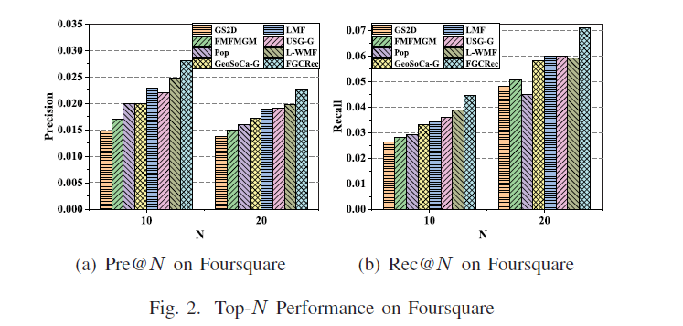
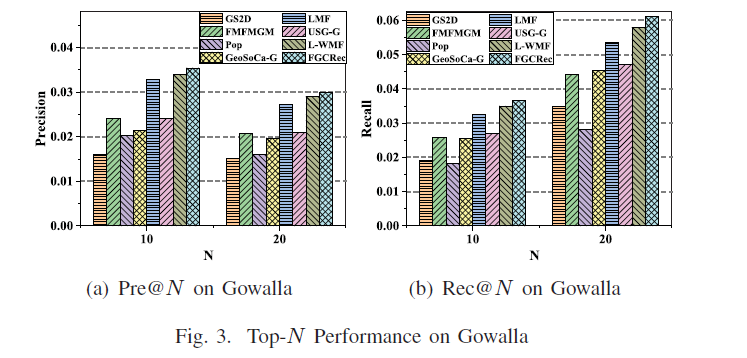

## FGCRec

FGCRec: Fine-Grained Geographical Characteristics Modeling for Point-of-Interest Recommendation (ICC 2020)

## Performance
- The performance of our framework on Foursquare.



- The performance of our framework on Gowalla.


## Requirements

- python==3.7


## Datasets

We use two real-world LBSN datasets from Foursquare and Gowalla.
```
Statistics:

| Dataset    | Number of users | Number of POIs | Number of check-ins| User-POI matrix density|
| ---------- | --------------- | -------------- | -------------------| ---------------------- |
| Foursquare | 7,642           | 28,484         | 512,523            | 0.13%                  |
| Gowalla    | 5,628           | 31,803         | 620,683            | 0.22%                  |
```

## How to run FGCRec model

```
python recommendation.py
```

## Citation
Please cite our paper if you use the code or datasets:
```
@inproceedings{su2020fgrec,
  title={FGCRec: Fine-Grained Geographical Characteristics Modeling for Point-of-Interest Recommendation},
  author={Yijun Su, Xiang Li, Baoping Liu, Daren Zha, Ji Xiang, Wei Tang and Neng Gao},
  booktitle={IEEE International Conference on Communications}, 
  pages={1-6},
  doi={10.1109/ICC40277.2020.9148797},
  year={2020}
}
```
## Contact

If you have any questions, please contact us by suyijun.ucas@gmail.com, we will be happy to assist.

Last Update Date: August 12, 2021